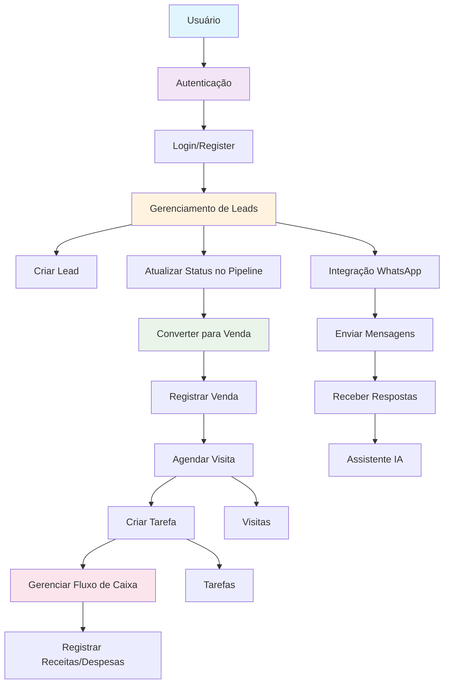

# API-04

API backend construída com Fastify, TypeScript e Drizzle ORM para gerenciar leads, imóveis, vendas, tarefas, visitas, fluxo de caixa e autenticação.

## Tecnologias

- Node.js
- TypeScript
- Fastify
- Drizzle ORM
- PostgreSQL
- Zod
- JWT
- Vitest
- Supertest
- Docker Compose

## Recursos principais

- Autenticação com JWT e refresh token
- CRUD de leads, imóveis, vendas, tarefas e visitas
- Gestão de fluxo de caixa
- Validação de dados com Zod
- Banco de dados PostgreSQL com migrações via Drizzle Kit
- Rotas versionadas em `/api/v1`
- Endpoint de saúde em `/health`

## Estrutura do projeto

- `src/main.ts` - ponto de entrada da aplicação
- `src/shared/server.ts` - configuração do Fastify e registro de rotas
- `src/config` - configuração de ambiente e JWT
- `src/database` - cliente e esquema do banco
- `src/middlewares` - middleware de autenticação e tratamento de erros
- `src/modules` - módulos de domínio (auth, leads, imoveis, vendas, tarefas, visitas, fluxo-caixa, whatsapp)
- `tests` - testes automatizados com Vitest

## Pré-requisitos

- Node.js 20+ recomendado
- npm
- Docker e Docker Compose (recomendado para PostgreSQL local)

## Configuração

1. Copie o arquivo de variáveis de ambiente ou crie um `.env` na raiz do projeto.
2. Configure as variáveis abaixo.
3. Rode o banco de dados PostgreSQL local com Docker Compose ou use a sua instância.

### Variáveis de ambiente necessárias

```env
PORT=3000
NODE_ENV=
DATABASE_URL=
TEST_DATABASE_URL=
JWT_SECRET=
JWT_EXPIRES_IN=15m
REFRESH_SECRET=
REFRESH_EXPIRES_IN=7d
FRONTEND_URL
EVOLUTION_API_URL
EVOLUTION_API_KEY
EVOLUTION_INSTANCE
OPENAI_API_KEY=
```

## Executando localmente

### Com Docker Compose

```bash
docker compose up -d
```

### Instalar dependências

```bash
npm install
```

### Rodar em modo de desenvolvimento

```bash
npm run dev
```

### Build de produção

```bash
npm run build
npm run start
```

## Banco de dados

### Migrações

```bash
npm run db:migrate
```

### Gerar esquema

```bash
npm run db:generate
```

### Studio Drizzle

```bash
npm run db:studio
```

## Testes

```bash
npm test
npm run test:watch
```

## Rotas principais

- `POST /api/v1/auth/register`
- `POST /api/v1/auth/login`
- `POST /api/v1/auth/refresh`
- `DELETE /api/v1/auth/logout`
- `GET /api/v1/auth/me`
- `PUT /api/v1/auth/me`

- `GET /api/v1/leads`
- `POST /api/v1/leads`
- `GET /api/v1/leads/pipeline`
- `GET /api/v1/leads/:id`
- `PUT /api/v1/leads/:id`
- `DELETE /api/v1/leads/:id`
- `PATCH /api/v1/leads/:id/status`

- `GET /health`

> Outras rotas estão disponíveis para `imoveis`, `vendas`, `tarefas`, `visitas` e `fluxo-caixa` dentro de `/api/v1`.

## Fluxo da Aplicação

O diagrama abaixo ilustra o fluxo principal de trabalho da aplicação:



## Observações

- A aplicação usa autenticação para proteger a maioria dos endpoints de domínio.
- Ajuste `FRONTEND_URL` para permitir requisições de seu front-end.
- As credenciais do Docker Compose são definidas em `docker-compose.yml`.
